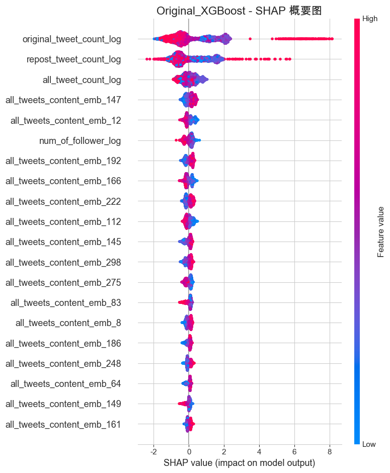

# Application-of-machine-learning-deep-learning-algorithms-in-the-detection-of-depressive-tendencies

- [Research Background](#research-background)
- [Data Source](#data-source)
- [Research Approach](#research-approach)
- [Data Preprocessing](#data-preprocessing)
- [Traditional Machine Learning Modeling](#traditional-machine-learning-modeling)
- [Deep Learning Modeling](#deep-learning-modeling)
- [Feature Importance Exploration](#feature-importance-exploration)
- [Ablation Experiment](#ablation-experiment)
- [Hyperparameter Tuning](#hyperparameter-tuning)
- [Summary and Reflection](#summary-and-reflection)

# Research Background

With the widespread use of social media, users' online behavior and posted content contain a wealth of information, providing new perspectives for mental health research. This study aims to explore the use of social media data, particularly user behavior characteristics (such as the number of posts and follow relationships) and text content (through word embedding representations) to build machine learning models for the early identification and auxiliary diagnosis of depressive tendencies in users. This will help improve the efficiency and accessibility of mental health screening, provide technical support for early intervention, and thereby improve individual well-being and public health.

# Data Source

The data is sourced from the Weibo user depression detection dataset collected and processed by Li Chenghao, Zhang Yilin, and others on GitHub
(WU3D). Data URL: https://github.com/aidenwang9867/Weibo-User-Depression-Detection-Dataset. The original files include two independent datasets stored in JSON format, where “depressed” represents users with depression and “normal” represents ordinary users. The user detail fields in the original dataset include, but are not limited to, nickname, gender, self-description, number of posts, follow relationships, and all posted tweets, which are relatively complex. During the data preprocessing stage, we will simplify the data.

# Research Approach

This study is divided into six sections: Section 1 covers data preprocessing; Section 2 employs traditional machine learning methods, including ensemble learning, for modeling and analysis; Section 3 uses deep learning methods to construct a Transformer model for modeling and analysis, and compares it with traditional models; Section 4 explores the importance of variables; the fifth part is an ablation experiment to explore the contribution of variables in different sections; the sixth part is hyperparameter tuning to obtain a better-performing model.

# Data Preprocessing

Considering modeling convenience and runtime factors, the data was simplified, and only gender(gender), profile (profile), number of followers (num_of_follower), number of follows (num_of_following), total number of tweets (all_tweet_count), original tweet count (original_tweet_count), repost count (repost_tweet_count), and the content of the top 10 tweets (all_tweets_content). Then, label depressed users as 1 and normal users as 0, and merge and randomize the two datasets.
For numerical variables, after plotting histograms and box plots to observe the distribution of the data, it was found that all numerical variables show severe right skewness, so these variables were log-transformed. After transformation, the data distribution became normal and could be directly used for modeling;

.png)

For the binary gender variable, one-hot encoding was performed to generate two new columns: gender_female and gender_male;
For self-descriptive and promotional texts, first replace “⽆” and empty strings with “PAD,” then perform basic processing such as word segmentation, regularization, and stopword removal.

.png)

Traditional machine learning modeling requires text vectorization, which involves vectorizing the text. word embedding is chosen over TF-IDF. This is because even after truncating the number of posts, there are still many small units after word segmentation.Using TF-IDF would not only lead to a dimension explosion, but no word embedding method can capture the advantages of semantic relationships. The word embedding model selected is the official embedding model from Wikipedia, set to 300 dimensions.
The following is an overview of the processed data.

.png)

# Traditional Machine Learning Modeling

This section divides the processed data into training and testing sets and defines a model evaluation and visualization function used to evaluate and select a suitable classification model to determine which model performs better in the classification task of predicting whether Weibo users are depressed. First, four baseline models were selected: logistic regression, naive Bayes classifier, decision tree, and support vector machine. Considering the potential impact of sample imbalance, after modeling each model using the original data, three resampling methods—oversampling, undersampling, and SMOTE—were also used for modeling. The performance of the four baseline models is summarized as follows (in fact, the resampling methods did not significantly improve model performance, demonstrating the modeling results of the original dataset):

As can be seen, the performance of the models on the test set is ranked as follows: decision tree model > logistic regression model = support vector machine model >> naive Bayes classifier model.
The Naive Bayes model performs poorly. The most likely reason is that the assumptions required by the 
the features are not only not independent but may also be highly correlated. This correlation likely stems from the semantic relationships between dimensions after embedding, such as the frequent co-occurrence of terms like “depression” and “low mood” in; numerical data may also be correlated, such as the number of followers and the number of posts; additionally, the data distribution not conforming to a normal distribution may also be a cause of poor model performance; 
The Logistic regression model and Support Vector Machine model perform similarly (subsequent analysis shows that their assessments of variable importance are also similar). This similarity primarily stems from their shared linear decision boundary characteristics. This suggests that some variables may exhibit strong linear separability in the data, or at least under the linear assumptions of these models, they exert a direct and significant linear influence on classification decisions. However, these two models may have limitations in capturing non-linear relationships between variables;
Decision tree models (non-linear models) have a slight advantage over logistic models (linear models) in various aspects. This is because decision tree models progressively partition the data space through a series of simple “yes/no” questions based on feature values (i.e., node splits in the tree). This hierarchical, recursive partitioning approach enables them to better adapt to complex non-linear patterns in the data and interactions between features, and can automatically discover and utilize feature interactions. In tasks such as predicting whether a Weibo user is depressed, which may involve combinations of non-linear features, the decision tree's ability to handle such scenarios gives it a slight
edge.
The following are the results of the decision tree model, which is the best performing model in this category of classification models, using oversampling technology:

To further investigate whether integrated learning models would perform better in this classification task, we selected Random Forest(representative of the bagging method) and XGBoost (representative of the boosting method) for modeling.

Overall, the random forest outperforms the best baseline model—a single decision tree—by a margin that is not as significant as one might expect. Possible reasons include: the baseline performance of a single decision tree is already quite good; the inherent complexity of the dataset may not have reached its limit; default parameters may not have fully exploited their potential (number of trees (n_estimators), feature subset ratio used by each tree during training (max_features or colsample_bytree), tree depth (max_depth), etc.). Although random forests did not yield a significant improvement in this study, as a representative of the Bagging method in ensemble learning, they still demonstrated their value as a powerful ensemble model by constructing multiple trees in parallel and reducing variance.
XGBoost successfully overcomes the limitations of previous models (such as Logistic Regression, Support Vector Machines, and even Random Forests) in handling complex non-linear relationships, preventing overfitting, and especially in identifying minority class samples. It not only delves deeply into the potential patterns of depression indicators in the data but also significantly improves the recall rate and F1 score for the critical minority class (depressed users) while accurately capturing the majority class. This makes it the best-performing and most practically applicable model to date in this task.

# Deep Learning Modeling

Furthermore, this study explored the performance of deep learning models in this classification task. Specifically, a multi-input deep learning model based on Transformer encoder blocks was constructed, followed by parameter tuning and model simplification + parameter tuning.The modeling results of the three deep learning models are as follows:

It can be seen that parameter tuning and model simplification do help improve the performance of transformer models.
Subsequently, we visualized the changes in loss and AUC values on the training and validation sets in the overall modeling process.We found that the model exhibited overfitting after epoch 1.

Following are the results of the simplified model after parameter adjustment. The specific model structure of Transformer is in the code folder.

After simplification and parameter tuning, deep learning is inferior to XGBoost, but outperforms other models. This does not mean that deep learning is inferior to XGBoost in classification tasks, but rather that the current dataset size (over 30,000 records, which is considered a small dataset, limiting the advantage of deep learning in handling large datasets) and the absence of hyperparameter tuning algorithms and NAS (Neural Architecture Search) automated neural network architecture algorithms may have contributed to the current results. This can also serve as a direction for further research.
In addition, deep learning models typically have higher requirements for computing resources and training time (some models running on CPUs can take up to half an hour to run). In practical applications, this may also affect our model selection trade-offs, especially in resource-constrained situations, where XGBoost can provide higher training efficiency while ensuring high performance.

# Feature Importance Exploration

This section presents the specific visualization results and their analysis in an HTML file.
For logistic regression and support vector machine models, the coefficients of the variables are directly used as the basis for measuring feature importance; decision trees can be judged based on the average Gini coefficient reduction value; random forests and XGBoost can both directly output built-in feature_importances.

 For the XGBoost model, feature importance analysis using SHAP values was also conducted, along with visualization across multiple dimensions.
 

  
 
From the results of several relatively reliable non-linear models, the number of original posts (logarithmic) and the number of reposts (logarithmic) are important in classifying whether a blogger is depressed. Compared to normal people, depressed patients show a polarized distribution of original and reposted Weibo posts: Some patients post/re-post very few messages, while others post/re-post a significant number of messages. Additionally, certain word embedding dimensions can effectively distinguish between healthy individuals and depressed patients, potentially indicating positive/negative emotions.

# Ablation Experiment

This section divides variables into three categories: numerical/binary categorical variables, introductory text, and promotional text.
A ablation experiment was conducted to investigate the contribution of different types of variables to the classification prediction task.
Based on the ablation experiment results, numerical/gender variables (primarily the number of original and retweeted posts) are the most important variables (the AUC score for a single numerical/gender variable reaches 0.9721); next are post word embedding vectors (the AUC score for a single post word embedding vector reaches 0.9397); while the summary section had little impact on the model, with accuracy and AUC values close to 0.5, indicating that using the summary alone is insufficient to identify whether an individual is depressed. Additionally, the combination of numerical + tweet variables performed nearly as well as the full set of variables. This aligns with the discussion on feature importance in the previous section.For more details, please refer to the code file.

# Hyperparameter Tuning

Finally, for the XGBoost model, we attempted to use random search methods for hyper parameter tuning to observe whether the tuned XGBoost model could perform even better.
Indeed, after hyper parameter tuning, the model's performance improved—the AUC value increased from 0.9858 to 0.9882.
This specifies the range of parameter changes, and the range can be appropriately expanded in the future to obtain a better model. In addition, trying other search algorithms is also a worthwhile option.

# Summary and Reflection

This study conducted multi-dimensional modeling analysis on the classification task of whether Weibo users are depressed. Ultimately, the XGBoost model achieved the best results. Through feature importance visualization and ablation experiments, it was determined that the number of original posts (logarithmically scaled) and the number of reposts (logarithmically scaled) are important in classifying whether a blogger is depressed. In addition, some word embedding dimensions can effectively distinguish between normal individuals and those with depression.
There are still many shortcomings in this study, such as insufficient data volume, which prevents the advantages of deep learning models from being fully demonstrated, information loss due to using only the first ten tweets, and parameter settings that are not yet scientific. These are areas that need to be improved in the future. However, overall, this study may provide some help in identifying whether Weibo bloggers are depressed.